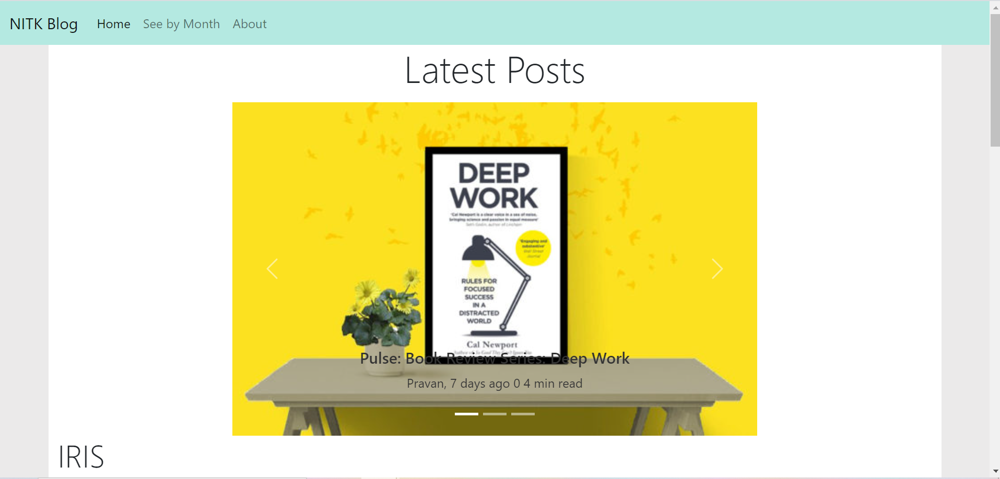

# One Blog To Rule Them All.
# Team: Phoenix
### Task: Unified Blogs Platform
###  Features implemented
* See the latest post from all three websites
* See posts according to their month published
* Carousel of three latest posts

#### Project link
[http://hrushi-flask.herokuapp.com/](http://hrushi-flask.herokuapp.com/)

### Tech Stack
* Flask(v1.1.2)
* Beautiful Soup4(v4.9.3)
* Requests(v2.25.1)
* Python(v3.9.1)

###  Setup Instructions
 ```
 On windows
 git clone https://github.com/hrushikeshj/Silicon-Maze-Blog.git
 cd Silicon-Maze-Blog
 py -3 -m venv venv
 venv\Scripts\activate
 pip install flask bs4 requests
 flask run
 ```
 Website should be running at [http://localhost:5000/](http://localhost:5000).
 
 [Demo video](/Blog%20-%20Google%20Chrome.mp4)



