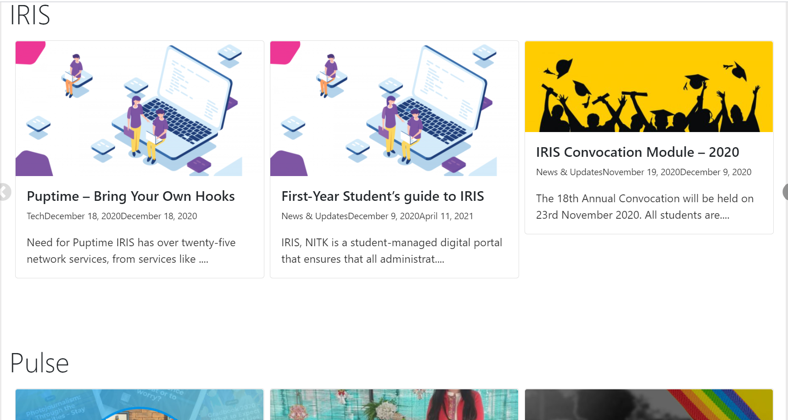
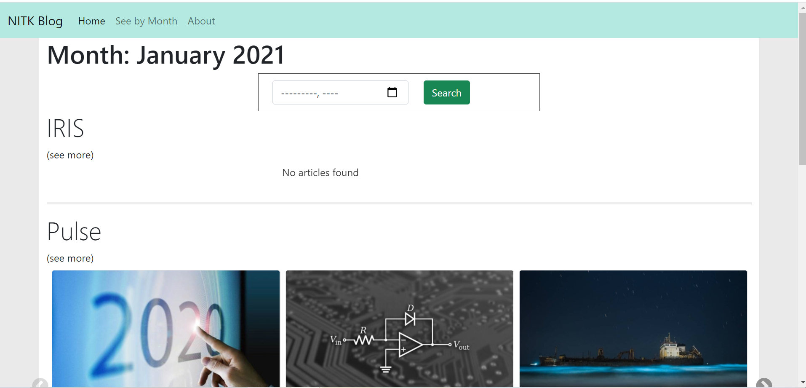

Web application to view the latest blog posts from  [Pulse NITK](https://pulse.nitk.ac.in/), [IRIS](https://blog.iris.nitk.ac.in/) and, [IEEE](https://ieee.nitk.ac.in/blog).

###  Features
* See the latest post from all three websites
* See posts according to their month published
* Carousel of three latest posts


### Tech Stack
* Flask
* Beautiful Soup4
* Requests
* Python
__________________________
###  Setup Instructions
 ```
 git clone https://github.com/hrushikeshj/Silicon-Maze-Blog.git
 cd Silicon-Maze-Blog
 py -3 -m venv venv
 venv\Scripts\activate
 pip install flask bs4 requests
 flask run
 ```
 Website should be running at [http://localhost:5000/](http://localhost:5000).
 ______________________


https://user-images.githubusercontent.com/66632353/177147542-6e58a33f-8605-4f81-99ab-3af68d1c6ae9.mp4




